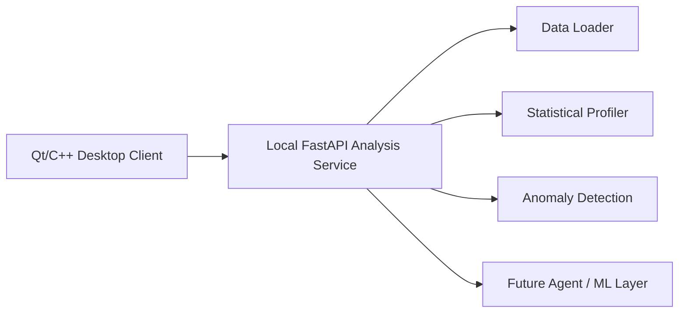

# InsightQt AI Workbench

> English version follows the Chinese version.

## 中文说明

InsightQt AI Workbench 是一个从旧版 Qt/C++ 统计分析工具演进而来的本地智能数据分析工作台。原项目可以读取 Excel/TXT 销售数据、计算基础统计量、绘制折线图和柱状图，并导出图表。第一轮现代化保留了 Qt 桌面端，同时新增了 Docker 化的 Python 分析服务，为后续机器学习、Agent 编排和自然语言分析报告打基础。

原始 Qt 版本保留在：

```text
legacy-qt-statistical-analysis
```

现代化开发分支：

```text
modern-ai-analysis-workbench
```

### 当前能力

- Qt/C++ 桌面端：保留原有数据表格、统计、图表和导出功能。
- Python 分析服务：读取 Excel、TXT、CSV 数据并返回结构化数据画像。
- 数据画像：行列数量、数值列数量、缺失值、每列均值/标准差/最小值/中位数/最大值。
- 异常检测底座：基于 z-score 标记高偏离数据点。
- Docker 运行：分析服务可以通过 `docker compose` 一键启动。

### 架构方向



### 运行 Python 分析服务

使用 Docker：

```bash
docker compose up --build
```

访问：

```text
http://127.0.0.1:8000/health
http://127.0.0.1:8000/api/datasets
```

分析示例数据：

```bash
curl -X POST http://127.0.0.1:8000/api/analyze ^
  -H "Content-Type: application/json" ^
  -d "{\"filename\":\"销售数据.txt\"}"
```

本地 Python 运行：

```bash
cd analysis_service
python -m pip install -r requirements.txt
uvicorn app.main:app --reload
```

测试：

```bash
cd analysis_service
python -m pytest -q
```

### Qt 桌面端

项目入口：

```text
Statistical_Analysis/Statistical_Analysis.pro
```

推荐 Kit：

```text
Qt 6.11.1 MinGW 64-bit
```

第一轮现代化已经把 `.pro` 中的旧绝对路径改为相对路径，并为 MinGW 添加了 QCustomPlot 兼容参数。旧版 Excel 解析库 `QXsl/lib/libQXlsx.a` 是 32 位静态库，不能直接用于当前 64 位 Qt 6 环境。后续路线是让 Qt 端调用本地 Python 分析服务，逐步移除 Qt 端对旧 QXlsx 的主路径依赖。

### 后续计划

- Qt 端调用 `/api/analyze`，展示分析结果。
- 增加机器学习异常检测和趋势分析。
- 增加本地 Ollama / OpenAI / fallback 的 Agent 解释层。
- 增加中英文 UI 和更专业的分析工作台界面。
- 增加 GitHub Actions CI。

## English

InsightQt AI Workbench is a modernization of an older Qt/C++ statistical analysis desktop application. The original application reads Excel/TXT sales data, computes basic statistics, renders line/bar charts, and exports charts. This first modernization pass keeps the Qt desktop client while adding a Dockerized Python analysis service as the foundation for future machine learning, Agent orchestration, and natural-language reporting.

The original Qt version is preserved in:

```text
legacy-qt-statistical-analysis
```

Modernization branch:

```text
modern-ai-analysis-workbench
```

### Current Capabilities

- Qt/C++ desktop client: keeps the original table, statistics, charting, and export workflow.
- Python analysis service: loads Excel, TXT, and CSV datasets and returns structured profiling results.
- Data profiling: rows, columns, numeric columns, missing cells, mean, standard deviation, min, median, and max.
- Anomaly detection foundation: flags high z-score cells for review.
- Docker runtime: the analysis service can be started with `docker compose`.

### Architecture Direction


### Run the Python Analysis Service

With Docker:

```bash
docker compose up --build
```

Open:

```text
http://127.0.0.1:8000/health
http://127.0.0.1:8000/api/datasets
```

Analyze a sample dataset:

```bash
curl -X POST http://127.0.0.1:8000/api/analyze ^
  -H "Content-Type: application/json" ^
  -d "{\"filename\":\"销售数据.txt\"}"
```

Run locally with Python:

```bash
cd analysis_service
python -m pip install -r requirements.txt
uvicorn app.main:app --reload
```

Tests:

```bash
cd analysis_service
python -m pytest -q
```

### Qt Desktop Client

Project entry:

```text
Statistical_Analysis/Statistical_Analysis.pro
```

Recommended Kit:

```text
Qt 6.11.1 MinGW 64-bit
```

This pass changes the old absolute paths in the `.pro` file to relative project paths and adds a MinGW compatibility flag for QCustomPlot. The legacy Excel library `QXsl/lib/libQXlsx.a` is a 32-bit static library and cannot be linked directly into the current 64-bit Qt 6 environment. The modernization path is to let the Qt client call the local Python analysis service and gradually remove the Qt-side dependency on the old QXlsx main path.
