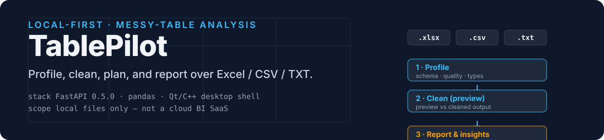
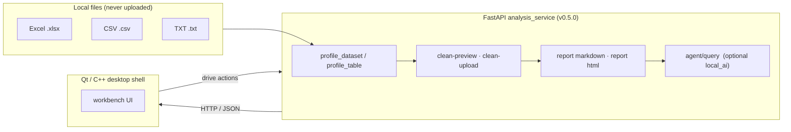
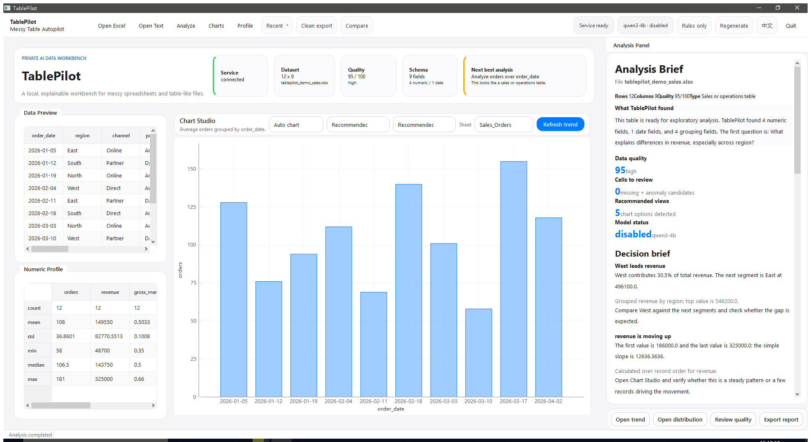
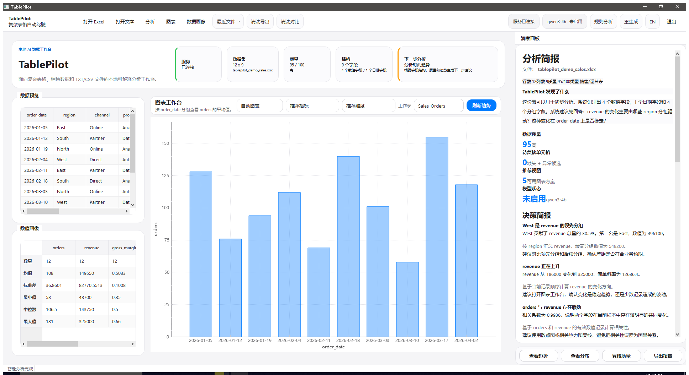
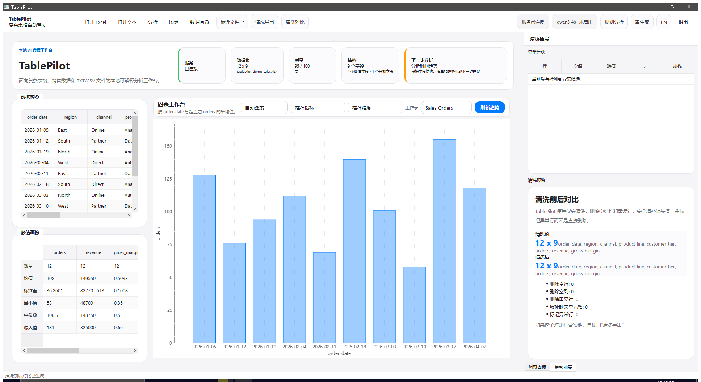
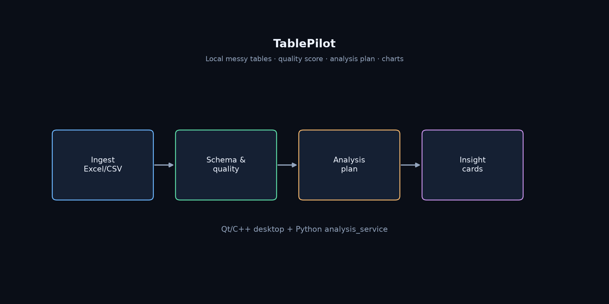

<p align="center">
  <picture>
    
  </picture>
</p>

<p align="center">
  
  <strong>Local-first messy-table workbench — profile, clean, plan, and report over Excel / CSV / TXT, without shipping your data to the cloud.</strong>
</p>

<p align="center">
  <a href="https://github.com/Phoenix0531-sudo/TablePilot/releases/download/v1.1.4/TablePilot-v1.1.4.exe"></a>
  <a href="https://github.com/Phoenix0531-sudo/TablePilot/actions/workflows/ci.yml"></a>
  <a href="https://github.com/Phoenix0531-sudo/TablePilot/actions/workflows/docker.yml"></a>
  <a href="https://github.com/Phoenix0531-sudo/TablePilot/actions/workflows/qt-desktop.yml"></a>
  <a href="https://github.com/Phoenix0531-sudo/TablePilot/actions/workflows/pages.yml"></a>
  
  
  
  
  
</p>

<p align="center">
  <a href="#overview">Overview</a> ·
  <a href="#features">Features</a> ·
  <a href="#quickstart">Quickstart</a> ·
  <a href="#architecture">Architecture</a> ·
  <a href="#performance">Performance</a> ·
  <a href="#proof">Proof</a> ·
  <a href="#scope">Scope</a> ·
  <a href="#faq">FAQ</a> ·
  <a href="#contributing">Contributing</a> ·
  <a href="README.zh-CN.md">中文</a>
</p>

---

## Overview

TablePilot is a **local-first workbench for messy tables**: it takes chaotic Excel / CSV / TXT files off your disk and turns them into a column profile, a cleaning preview, an analysis plan, and an explainable report — without shipping your data to the cloud.

It is a hybrid stack. A **Python FastAPI analysis service** (`analysis_service/`) does the profiling, cleaning, reporting, and optional local-AI narration. A **Qt / C++ desktop shell** (`packaging/`, `qss/`, `Statistical_Analysis/`) gives the local analyst a real keyboard-and-table UI. You can also run the service alone — every capability is reachable over HTTP and the auto-generated Swagger UI.

> Local files only by default. This is not a cloud BI SaaS and never uploads anything on your behalf.

## Features

Real capabilities wired into `analysis_service/app/main.py` (service `v0.5.0`):

- **Dataset directory** — `GET /api/datasets` lists the local data dir; `POST /api/analyze` (and `-upload`) load a table by name or by file upload, with optional Excel `sheet`.
- **Table profiling** — `profile_dataset` / `profile_table` produce a schema- and quality-oriented profile per table.
- **Cleaning preview & output** — `POST /api/clean-preview-upload` shows *what would change*; `POST /api/clean-upload` returns the cleaned table. Compare before/after directly.
- **Reports** — `POST /api/report/markdown` (plain text) and `POST /api/report/html` (HTML) generate explainable, copy-pasteable artifacts.
- **Agent narrative** — `POST /api/agent/query` answers a free-text question over a table; pass `local_ai: true` to opt into the optional local-model enhancement path (`ollama`-style).
- **Session export** — `POST /api/session/export` snapshots the current analysis session as JSON.
- **Health** — `GET /health` for liveness and container probes.

Desktop shell adds a Qt/C++ oriented experience on top of the same service surface (see `packaging/`, `qss/`).

## Quickstart

### Windows one-click (prebuilt desktop shell)

Grab the CI-built binary from Releases — no Python, Qt, or compiler needed on your machine:

1. Download **[TablePilot-v1.1.4.exe](https://github.com/Phoenix0531-sudo/TablePilot/releases/download/v1.1.4/TablePilot-v1.1.4.exe)** (~1.0 MB) from the [Releases](https://github.com/Phoenix0531-sudo/TablePilot/releases) page — it is the same `TablePilot.exe` the `qt-desktop` CI builds from `Statistical_Analysis.pro` on a clean Windows runner.
2. Double-click to launch the desktop shell.
3. To use profile / clean / report features, point the shell at a running analysis service — either `docker compose up --build` (below) or `uvicorn app.main:app --reload` (further below).

> Tip: the exe is a standalone Windows binary; the FastAPI analysis service must be running separately for the desktop shell to talk to `/api/*`.

### From source (analysis service + desktop shell)

```bash
git clone https://github.com/Phoenix0531-sudo/TablePilot.git
cd TablePilot/analysis_service
python -m venv .venv && source .venv/bin/activate   # Windows: .venv\Scripts\activate
pip install -r requirements.txt
uvicorn app.main:app --reload
```

Then open the auto-generated docs at <http://127.0.0.1:8000/docs> and try `GET /api/datasets` + `POST /api/analyze`. For a full endpoint reference with copy-pasteable `curl` examples and a `demo/` sample-table walkthrough, see **[docs/API.md](docs/API.md)**.

| Goal | Command |
| --- | --- |
| Start the analysis service | `uvicorn app.main:app --reload` (in `analysis_service/`) |
| Browse API / try endpoints | open `http://127.0.0.1:8000/docs` |
| Run tests | `pytest tests/ analysis_service/tests/` |
| Run the service in Docker | `docker compose up --build` then probe `GET /health` |
| Build the desktop shell | `Statistical_Analysis/Statistical_Analysis.pro` with Qt 6 + MSVC (see `qt-desktop.yml`) or follow `packaging/` |

### End-to-end in 60 seconds

Once the service is up, one command walks one bundled table — `demo/quality_issues_demo.csv` (duplicate rows, missing cells, and a revenue outlier) — through the three core endpoint families (profile → clean-preview → report):

```bash
bash scripts/demo_e2e.sh
```

Expected highlights:

- `GET /api/analyze` reports the dataset shape, a 0–100 quality score, and anomaly count.
- `POST /api/clean-preview-upload` returns how many duplicate rows it would drop, missing cells it would fill, and anomaly rows it would flag — without mutating the file.
- `POST /api/report/markdown` prints the first 20 lines of an explainable, copy-pasteable report.

Point `BASE` at a different host if the service runs elsewhere (`BASE=http://localhost:9000 bash scripts/demo_e2e.sh`).

Sample tables live in `demo/`. The Pages site renders at <https://phoenix0531-sudo.github.io/TablePilot/>.

## Architecture



The **service is the contract**: every feature is an HTTP endpoint, so the desktop shell and the OpenAPI UI drive exactly the same surface. No hidden Python calls across the process boundary. Each node above maps to a real route in [`docs/API.md`](docs/API.md) and `docs/openapi.json` (10 paths); the `demo-e2e` CI job exercises profile → clean-preview → report end-to-end against a live service.

### Repo layout

```
analysis_service/      # FastAPI service (primary automated surface), v0.5.0
Statistical_Analysis/  # Qt / C++ desktop shell sources (main.cpp, mainwindow.*, .pro)
demo/                  # sample tables
packaging/             # desktop packaging / build scripts
assets/screenshots/    # real UI captures
docs/                  # docs + project-page sources
site/                  # GitHub Pages content
docker-compose.yml
tests/                 # pytest suite (analysis_service + standalone smoke)
```

## Proof

Real UI captures from a local run (also in `assets/screenshots/`):

<table>
<tr>
<td width="50%"><br><sub>Desktop workbench — overview with data preview and analysis brief</sub></td>
<td width="50%"><br><sub>中文洞察面板 — Chinese-language insight cards</sub></td>
</tr>
<tr>
<td width="50%"><br><sub>Clean-up comparison — dirty vs. cleaned side by side</sub></td>
<td width="50%"><br><sub>Architecture schematic — files → service → shell/reports</sub></td>
</tr>
</table>

## Performance

Measured by `scripts/bench.py` (median of 5 runs, in-process, on an `ubuntu-latest` CI runner — no server/network jitter). Run it locally with `python scripts/bench.py`.

| Workload | Rows | Operation | Median wall-clock |
| --- | --- | --- | --- |
| `demo/quality_issues_demo.csv` (real) | 14 | profile | ~17 ms |
| `demo/quality_issues_demo.csv` (real) | 14 | clean-preview | ~12 ms |
| `demo/quality_issues_demo.csv` (real) | 14 | markdown report | ~16 ms |
| synthetic re-sampling of the demo pattern | 9,996 | profile | ~346 ms |

These are CI-observed numbers from a real run ([job log](https://github.com/Phoenix0531-sudo/TablePilot/actions/runs/31948192866)), not estimates. The `bench` CI job re-measures on every push and asserts each metric is a positive real number, so they cannot silently rot. The synthetic 10k-row row is a generated re-sampling of the real demo rows, not real user data — it only exists to show the scaling curve, not to claim a representative workload.

## Scope

- **In:** local Excel / CSV / TXT profiling, cleaning previews and cleaned output, analysis plans, HTML & Markdown reports, optional local-AI narration, and the desktop + service hybrid architecture.
- **Out:** multi-tenant cloud warehouse, full Excel formula compatibility, real-time collaboration, and any form of remote data storage.

## FAQ

<details>
<summary><b>Do I need an internet connection?</b></summary>

No. TablePilot is local-first — it reads files from your disk and the service runs on `127.0.0.1`. The optional `local_ai` path points at a local model (e.g. <code>ollama</code>); nothing leaves your machine unless you explicitly configure it to.
</details>

<details>
<summary><b>Can I use just the FastAPI service without the Qt shell?</b></summary>

Yes. The service is a first-class surface on its own: <code>pip install -r requirements.txt</code> + <code>uvicorn app.main:app --reload</code>, then drive every capability over HTTP via <code>/docs</code>. The Qt desktop shell is an optional, richer UI on top of the same endpoints.
</details>

<details>
<summary><b>Where does my data go?</b></summary>

Nowhere by default. Files are loaded from a local data directory (or an upload) and processed in-process; TablePilot does not transmit, sync, or persist your tables to any remote location.
</details>

## Contributing

Contributions are welcome — see [CONTRIBUTING.md](CONTRIBUTING.md). The short version: keep it **local-first** (no remote uploads in the default path), **evidence-grounded** (agent/report output derives from the actual profiled data), and **honest in docs** (don't describe a capability the code doesn't ship). Run `python -m pytest -q analysis_service/tests` before opening a PR.

See also: [CHANGELOG.md](CHANGELOG.md) · [SECURITY.md](SECURITY.md) · [docs/API.md](docs/API.md)

## License

MIT — see [LICENSE](LICENSE).

---

<sub>This README was drafted with AI assistance and verified by hand against the actual codebase — the FastAPI service version (<code>v0.5.0</code>), the live endpoint list in <code>analysis_service/app/main.py</code>, the dependency manifests, and the CI workflows — so the claims above match what the repository actually ships.</sub>
