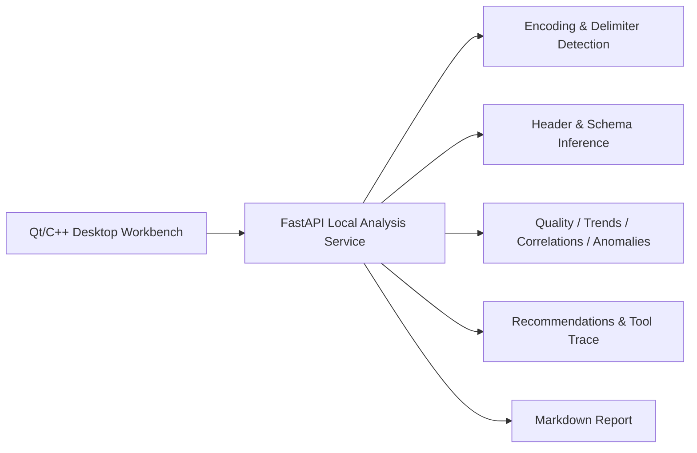

# InsightQt AI Workbench


> 中文说明在前，English version follows.

## 中文

InsightQt AI Workbench 是一个由旧版 Qt/C++ 统计分析工具升级而来的本地智能表格数据分析工作台。项目采用 **Qt/C++ 桌面端 + Dockerized Python/FastAPI 分析服务** 的组合：Qt 负责本地桌面交互、表格和图表展示，Python 服务负责动态表格解析、字段识别、数据质量评分、分析推荐和 Agent 风格工具链。

原始版本保留在 `legacy-qt-statistical-analysis`。现代化版本在 `modern-ai-analysis-workbench`。

### 核心能力

- 支持 Excel、CSV、TXT 表格数据。
- TXT/CSV 自动识别编码与分隔符，包括 comma、tab、semicolon、pipe、whitespace。
- 自动判断是否存在表头。
- 自动识别字段类型：numeric、date、category、text、empty、high-cardinality。
- 动态表格展示，不再限制 6 行 6 列。
- 动态统计表，只对数值列生成 count、mean、std、min、median、max。
- 动态图表，自动选择 Top 数值列，避免固定 A-F 和固定月份。
- 数据质量评分：缺失值、重复行、异常值、字段可分析性、样本量。
- Executive Brief：自动生成结论摘要、置信度、风险提示和下一步分析建议。
- 分析推荐：趋势、分组对比、相关性、异常复核、缺失值检查。
- Chart Recommendation：根据 schema 推荐 line/bar/none。
- Agent Tool Trace：展示从加载数据到生成 insight 的分析路径。
- Markdown 报告接口，为后续桌面端导出报告和 Release 版本打底。

### 产品体验

- 顶部工作台概览条展示服务状态、数据规模、质量分、字段结构和下一步建议。
- 左侧为动态数据预览和数值画像，不再保留旧版固定 A-F / 1-6 月假设。
- 中间图表区支持趋势视图和分布视图，并使用统一的数据工作台视觉风格。
- 右侧 Insight Panel 以结构化 Brief 展示 Executive Summary、Watchouts、Recommended Next Moves、Schema Snapshot 和 Tool Trace。
- UI 采用更接近金融/数据产品的低饱和界面：浅色画布、深色工具栏重点、绿色分析状态和琥珀色建议强调。

### 架构



### 快速运行

启动分析服务：

```bash
docker compose up --build
```

检查服务：

```text
http://127.0.0.1:8000/health
```

Qt 桌面端入口：

```text
Statistical_Analysis/Statistical_Analysis.pro
```

推荐 Kit：

```text
Qt 6.11.1 MinGW 64-bit
```

打开 Qt 程序后，可以选择 Excel、CSV 或 TXT 文件。桌面端会上传文件到本地服务，并动态刷新表格、统计表、图表和右侧 AI Insight 面板。

### API 示例

分析仓库内数据：

```bash
curl -X POST http://127.0.0.1:8000/api/analyze ^
  -H "Content-Type: application/json" ^
  -d "{\"filename\":\"销售数据.txt\"}"
```

上传任意本地表格：

```bash
curl -X POST http://127.0.0.1:8000/api/analyze-upload ^
  -F "file=@samples/sales_sample.csv"
```

Agent 风格查询：

```bash
curl -X POST http://127.0.0.1:8000/api/agent/query ^
  -H "Content-Type: application/json" ^
  -d "{\"filename\":\"销售数据.txt\",\"question\":\"这份数据有没有异常？\"}"
```

生成 Markdown 报告：

```bash
curl -X POST http://127.0.0.1:8000/api/report/markdown ^
  -H "Content-Type: application/json" ^
  -d "{\"filename\":\"销售数据.txt\"}"
```

### 本地开发

```bash
cd analysis_service
python -m pip install -r requirements-dev.txt
python -m pytest -q
uvicorn app.main:app --reload
```

### 示例数据

`samples/` 包含多种用于验证动态解析能力的数据：

- `sales_sample.csv`
- `mixed_schema_sample.csv`
- `missing_values_sample.csv`
- `time_series_sample.csv`
- `txt_tab_sample.txt`
- `txt_space_sample.txt`

### 工程化状态

- Docker Compose 运行分析服务。
- GitHub Actions 验证 Python 测试、Docker build 和 Python package metadata。
- `analysis_service/pyproject.toml` 提供 Python 包元数据。
- `LICENSE` 使用 MIT License。
- `GITHUB_ABOUT.md` 提供 GitHub About 文案和 topics。

Release 安装包暂未生成。后续可以在 UI 稳定后加入 Windows 打包流程，例如 Qt deploy + 服务启动脚本 + GitHub Release。

## English

InsightQt AI Workbench modernizes an older Qt/C++ statistical desktop tool into a local intelligent table analysis workbench. It combines a **Qt/C++ desktop client** with a **Dockerized Python/FastAPI analysis service**. Qt handles local desktop interaction, tables, and charts; Python handles dynamic parsing, schema inference, data quality scoring, recommendations, and Agent-style tool traces.

The original version is preserved in `legacy-qt-statistical-analysis`. Modern work lives in `modern-ai-analysis-workbench`.

### Capabilities

- Supports Excel, CSV, and TXT table data.
- Detects text encodings and delimiters, including comma, tab, semicolon, pipe, and whitespace.
- Infers whether a header row exists.
- Infers semantic column types: numeric, date, category, text, empty, and high-cardinality.
- Dynamic table display with no fixed 6x6 assumption.
- Dynamic statistics table for numeric columns: count, mean, std, min, median, max.
- Dynamic charting over top numeric columns instead of fixed A-F fields.
- Data quality scoring based on missing values, duplicates, anomalies, analyzability, and sample size.
- Analysis recommendations for trends, group comparisons, correlations, anomaly review, and missing values.
- Chart recommendations based on the inferred schema.
- Agent Tool Trace from table loading to insight generation.
- Executive Brief with conclusion summary, confidence, watchouts, and next recommended analysis moves.
- Markdown report endpoint for future desktop report export and Release packaging.

### Product Experience

- A top workbench overview strip shows service status, dataset shape, quality score, schema structure, and the next best analysis.
- The left side contains dynamic data preview and numeric profiling without the old fixed A-F / six-month assumptions.
- The chart area provides trend and distribution views with a consistent data-workbench visual style.
- The right Insight Panel renders a structured brief with Executive Summary, Watchouts, Recommended Next Moves, Schema Snapshot, and Tool Trace.
- The UI now uses a more portfolio-ready financial/data-product style: warm canvas, dark command surface, green analysis status, and amber recommendation accents.

### Architecture


### Quick Start

Start the analysis service:

```bash
docker compose up --build
```

Health check:

```text
http://127.0.0.1:8000/health
```

Qt desktop entry:

```text
Statistical_Analysis/Statistical_Analysis.pro
```

Recommended Kit:

```text
Qt 6.11.1 MinGW 64-bit
```

After launching the Qt app, open an Excel, CSV, or TXT file. The desktop client uploads the file to the local analysis service and refreshes the table, statistics, chart, and AI Insight panel dynamically.

### Development

```bash
cd analysis_service
python -m pip install -r requirements-dev.txt
python -m pytest -q
uvicorn app.main:app --reload
```

### Sample Data

The `samples/` directory includes datasets for dynamic parser validation:

- `sales_sample.csv`
- `mixed_schema_sample.csv`
- `missing_values_sample.csv`
- `time_series_sample.csv`
- `txt_tab_sample.txt`
- `txt_space_sample.txt`

### Engineering Notes

- Docker Compose runs the local analysis service.
- GitHub Actions validates service tests, Docker build, and package metadata.
- `analysis_service/pyproject.toml` defines Python package metadata.
- `LICENSE` uses MIT License.
- `GITHUB_ABOUT.md` contains suggested GitHub About copy and topics.

Windows installer packaging is intentionally left for a later Release pass after the UI is finalized.
