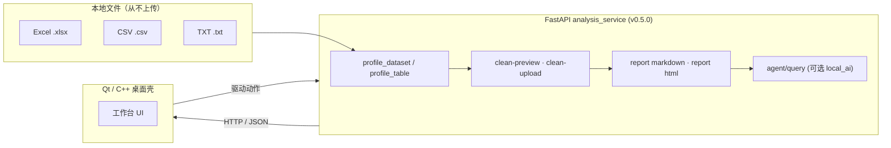

<p align="center">
  <picture>
    
  </picture>
</p>

<p align="center">
  
  <strong>本地优先的脏表工作台——对 Excel / CSV / TXT 做画像、清洗、方案与报告，不把数据送到云端。</strong>
</p>

<p align="center">
  <a href="https://github.com/Phoenix0531-sudo/TablePilot/releases/download/v1.1.6/TablePilot-v1.1.6.exe"></a>
  <a href="https://github.com/Phoenix0531-sudo/TablePilot/actions/workflows/ci.yml"></a>
  <a href="https://github.com/Phoenix0531-sudo/TablePilot/actions/workflows/docker.yml"></a>
  <a href="https://github.com/Phoenix0531-sudo/TablePilot/actions/workflows/qt-desktop.yml"></a>
  <a href="https://github.com/Phoenix0531-sudo/TablePilot/actions/workflows/pages.yml"></a>
  
  
  
  
  
</p>

<p align="center">
  <a href="#概述">概述</a> ·
  <a href="#核心功能">核心功能</a> ·
  <a href="#快速开始">快速开始</a> ·
  <a href="#架构">架构</a> ·
  <a href="#性能">性能</a> ·
  <a href="#实证">实证</a> ·
  <a href="#范围">范围</a> ·
  <a href="#faq">FAQ</a> ·
  <a href="#贡献">贡献</a> ·
  <a href="README.md">English</a>
</p>

---

## 概述

TablePilot 是一个**本地优先的脏表工作台**：把你磁盘上混乱的 Excel / CSV / TXT 文件变成列画像、清洗预览、分析方案与可解释的报告，且不把数据送到云端。

它是一个混合架构栈。**Python FastAPI 分析服务**（`analysis_service/`）负责画像、清洗、报告与可选的本地 AI 叙事；**Qt / C++ 桌面壳**（`packaging/`、`qss/`、`Statistical_Analysis/`）给本地分析师一个真正的键盘 + 表格界面。你也可以单独跑服务——所有能力都通过 HTTP 与自动生成的 Swagger UI 暴露。

> 默认仅本地文件。这不是云 BI SaaS，也不会替你上传任何东西。

## 核心功能

`analysis_service/app/main.py`（服务 `v0.5.0`）接入的真实能力：

- **数据集目录** — `GET /api/datasets` 列出本地数据目录；`POST /api/analyze`（与 `-upload`）按名称或上传文件加载表格，支持可选 Excel `sheet`。
- **表画像** — `profile_dataset` / `profile_table` 输出面向 schema 与质量画像的表格画像。
- **清洗预览与结果** — `POST /api/clean-preview-upload` 展示*会改什么*；`POST /api/clean-upload` 返回清洗后表格。可直接对比前后。
- **报告** — `POST /api/report/markdown`（纯文本）与 `POST /api/report/html`（HTML）生成可解释、可复制粘贴的产物。
- **Agent 叙事** — `POST /api/agent/query` 基于表格回答自由文本问题；传 `local_ai: true` 进入可选的本地模型增强路径（`ollama` 类）。
- **会话导出** — `POST /api/session/export` 把当前分析会话以 JSON 快照导出。
- **健康检查** — `GET /health` 供存活探针与容器健康检查。

桌面壳在相同服务接口之上提供 Qt/C++ 体验（见 `packaging/`、`qss/`）。

## 快速开始

### Windows 一键安装（预构建桌面壳）

从 Releases 下载 CI 构建的二进制——本机无需 Python / Qt / 编译器：

1. 从 [Releases](https://github.com/Phoenix0531-sudo/TablePilot/releases) 页下载 **[TablePilot-v1.1.6.exe](https://github.com/Phoenix0531-sudo/TablePilot/releases/download/v1.1.6/TablePilot-v1.1.6.exe)**（约 1.0 MB）——它就是 `qt-desktop` CI 在干净的 Windows runner 上从 `Statistical_Analysis.pro` 构建出的同一个 `TablePilot.exe`。
2. 双击启动桌面壳。
3. 要使用画像 / 清洗 / 报告功能，让桌面壳指向一个正在运行的分析服务——要么 `docker compose up --build`（见下），要么 `uvicorn app.main:app --reload`（再下）。

> 提示：该 exe 是独立 Windows 二进制；FastAPI 分析服务须单独运行，桌面壳才能调用 `/api/*`。

### 从源码跑（分析服务 + 桌面壳）

```bash
git clone https://github.com/Phoenix0531-sudo/TablePilot.git
cd TablePilot/analysis_service
python -m venv .venv && source .venv/bin/activate   # Windows: .venv\Scripts\activate
pip install -r requirements.txt
uvicorn app.main:app --reload
```

然后打开自动生成的文档 <http://127.0.0.1:8000/docs>，依次试 `GET /api/datasets` + `POST /api/analyze`。完整端点参考（含可复制的 `curl` 示例与 `demo/` 样表走查）见 **[docs/API.md](docs/API.md)**。

| 目标 | 命令 |
| --- | --- |
| 启动分析服务 | `uvicorn app.main:app --reload`（在 `analysis_service/` 内） |
| 浏览 API / 试用端点 | 打开 `http://127.0.0.1:8000/docs` |
| 跑测试 | `pytest tests/ analysis_service/tests/` |
| Docker 跑服务 | `docker compose up --build`，再探 `GET /health` |
| 构建桌面壳 | 用 `Statistical_Analysis/Statistical_Analysis.pro` + Qt 6 + MSVC（见 `qt-desktop.yml`）或参考 `packaging/` |
### 60 秒端到端体验

服务跑起来后，一条命令把内置表 `demo/quality_issues_demo.csv`（含重复行、缺失值、离群值）走完三个核心端点（画像 → 清洗预览 → 报告）：
```bash
bash scripts/demo_e2e.sh
```
预期亮点：
- `GET /api/analyze` 报表形状、0–100 质量评分与异常行数。
- `POST /api/clean-preview-upload` 返回会删多少重复行、补多少缺失值、标多少异常行——不改原文件。
- `POST /api/report/markdown` 打印可解释、可复制报告的前 20 行。
服务跑在别处用 `BASE=http://localhost:9000 bash scripts/demo_e2e.sh`。

示例表格在 `demo/`。项目页：<https://phoenix0531-sudo.github.io/TablePilot/>。

## 架构



**服务即契约**：每个功能都是一个 HTTP 端点，桌面壳与 OpenAPI UI 驱动的是完全相同的接口，进程边界之外没有任何隐藏的 Python 互调。上图每个节点都对应 [`docs/API.md`](docs/API.md) 与 `docs/openapi.json`（10 个路径）中的真实路由；`demo-e2e` CI 任务会对真实服务跑画像 → 清洗预览 → 报告的端到端验证。

### 仓库布局

```
analysis_service/      # FastAPI 服务（主要自动化接口），v0.5.0
Statistical_Analysis/  # Qt / C++ 桌面壳源码（main.cpp、mainwindow.*、.pro）
demo/                  # 示例表格
packaging/             # 桌面打包 / 构建脚本
assets/screenshots/    # 真实 UI 截图
docs/                  # 文档 + 项目页源
site/                  # GitHub Pages 内容
docker-compose.yml
tests/                 # pytest 测试套件（analysis_service + 独立 smoke）
```

## 实证

本地真实运行的 UI 截图（亦在 `assets/screenshots/`）：

<table>
<tr>
<td width="50%"><br><sub>桌面工作台 — 数据预览与分析概要</sub></td>
<td width="50%"><br><sub>中文洞察面板 — 自然语言洞察卡片</sub></td>
</tr>
<tr>
<td width="50%"><br><sub>清洗前后对比 — 脓表与清洗后并排</sub></td>
<td width="50%"><br><sub>架构示意图 — 本地文件 → 服务 → 桌面壳与报告</sub></td>
</tr>
</table>

## 性能

由 `scripts/bench.py` 测得（5 次运行取中位数，进程内调用，在 `ubuntu-latest` CI 运行器上——无服务器/网络抖动）。本地可用 `python scripts/bench.py` 复现。

| 负载 | 行数 | 操作 | 中位耗时 |
| --- | --- | --- | --- |
| `demo/quality_issues_demo.csv`（真实） | 14 | 画像 | ~17 ms |
| `demo/quality_issues_demo.csv`（真实） | 14 | 清洗预览 | ~12 ms |
| `demo/quality_issues_demo.csv`（真实） | 14 | Markdown 报告 | ~16 ms |
| 对 demo 模式的合成重采样 | 9,996 | 画像 | ~346 ms |

这些是真实 CI 运行（[job 日志](https://github.com/Phoenix0531-sudo/TablePilot/actions/runs/31948192866)）观测到的数字，不是估算。`bench` CI 任务在每次推送时重新测量并断言每个指标为正实数，不会默默失效。那一行合成的 10k 行是对真实 demo 行的重采样生成数据，不是真实用户数据——只为展示Scaling曲线，不代表典型工作负载。

## 范围

- **In（做）：** 本地 Excel / CSV / TXT 画像、清洗预览与清洗结果、分析方案、HTML 与 Markdown 报告、可选本地 AI 叙事、桌面 + 服务混合架构。
- **Out（不做）：** 多租户云数仓、完整 Excel 公式兼容、实时协同、以及任何形式的远程数据存储。

## FAQ

<details>
<summary><b>需要联网吗？</b></summary>

不需要。TablePilot 本地优先——从磁盘读文件、服务跑在 `127.0.0.1`。可选的 `local_ai` 路径指向本地模型（如 `ollama`）；除非你显式配置，否则数据不会离开你的机器。
</details>

<details>
<summary><b>能只用 FastAPI 服务、不装 Qt 桌面壳吗？</b></summary>

可以。服务本身就是一等接口：`pip install -r requirements.txt` + `uvicorn app.main:app --reload`，再通过 `/docs` 用 HTTP 驱动所有能力。Qt 桌面壳是叠加在相同端点之上的、更丰富的可选 UI。
</details>

<details>
<summary><b>我的数据会去哪？</b></summary>

默认哪儿都不去。文件来自本地数据目录（或上传），并在进程内处理；TablePilot 不会把你的表格传输、同步或持久化到任何远程位置。
</details>

## 贡献

欢迎贡献 —— 见 [CONTRIBUTING.md](CONTRIBUTING.md)。简版原则：**本地优先**（默认路径不上传远程）、**证据为本**（agent/report 产物源自真实画像数据）、**文档诚实**（不描述代码没有的能力）。提交 PR 前跑 `python -m pytest -q analysis_service/tests`。

另见：[CHANGELOG.md](CHANGELOG.md) · [SECURITY.md](SECURITY.md) · [docs/API.md](docs/API.md)

## 许可证

MIT —— 详见 [LICENSE](LICENSE)。

---

<sub>本 README 由 AI 辅助起草，并基于实际代码人工校验——FastAPI 服务版本（`v0.5.0`）、`analysis_service/app/main.py` 中的真实端点列表、依赖清单与 CI workflow——以上描述与仓库实际交付内容一致。</sub>
