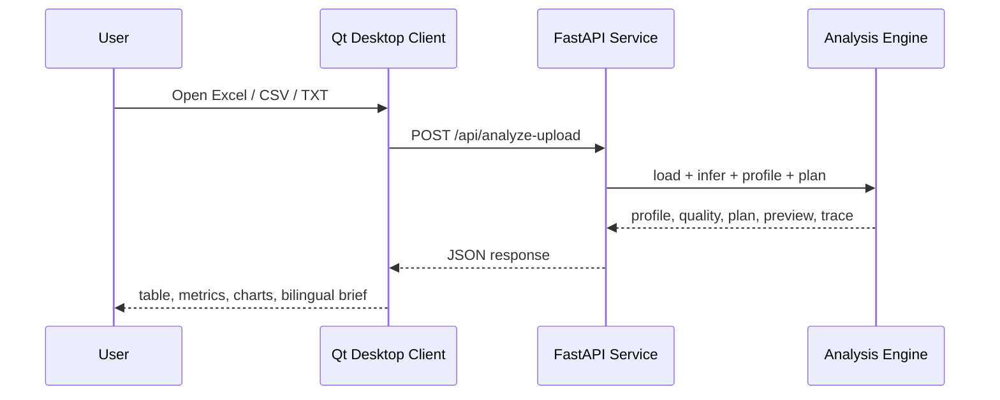

# Architecture

## Module Boundaries

- `Statistical_Analysis/`: Qt/C++ desktop client. It owns window layout, local file selection, table preview, chart rendering, language switching, and desktop release behavior.
- `analysis_service/app/`: FastAPI analysis service. It owns file parsing, schema inference, data quality scoring, deterministic planning, report generation, and API contracts.
- `analysis_service/tests/`: API and analysis behavior tests.
- `samples/`: small deterministic datasets for manual demos and CI smoke tests.
- `packaging/`: Windows release packaging and startup scripts.
- `docs/`: bilingual user-facing documentation and architecture notes.
- `tasks/`: modernization log and implementation review notes.

## Runtime Flow

## Design Rules

- Keep numerical analysis deterministic and testable in Python.
- Keep the Qt layer focused on desktop interaction and visualization.
- Keep LLM/Agent-style behavior evidence-grounded through explicit planner steps and tool traces.
- Do not commit generated release artifacts; release outputs belong in `dist/`.
- Preserve the legacy branch as historical source, and keep modernization work on `modern-ai-analysis-workbench`.
