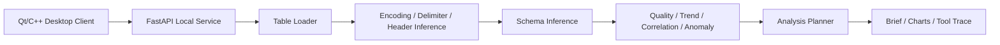

# LatticeIQ Documentation

LatticeIQ modernizes an older Qt/C++ statistical analysis tool into a local AI table analysis workbench. The goal is not another fixed Excel charting demo. The goal is to turn messy table files into explainable profiling, quality assessment, analysis planning, and an interactive desktop experience.

## Why It Stands Out

- **Local-first**: data stays on the machine; the desktop client works with a local Docker service.
- **Cross-stack engineering**: Qt/C++ for the desktop product, Python/FastAPI for parsing and analysis.
- **Dynamic table parsing**: no fixed 6x6 assumption; supports Excel, CSV, and TXT.
- **Analysis Planner**: recommends a workflow from schema roles, quality signals, trends, correlations, and anomalies.
- **Explainable output**: includes evidence, schema, quality, and tool trace instead of opaque conclusions.
- **Release-oriented**: includes Docker, CI, Windows release packaging scripts, and structured documentation.

## Features

- Excel / CSV / TXT ingestion.
- Encoding, delimiter, and header inference for text tables.
- Semantic schema inference: numeric, date, category, text, empty, high-cardinality.
- Data quality scoring from missing values, duplicates, anomalies, sample size, and analyzability.
- Recommended analysis: trends, segment comparison, correlations, anomaly review, and quality checks.
- Chart recommendation from inferred schema.
- Executive Brief with headline, confidence, watchouts, and next moves.
- Analysis Planner with workflow steps.
- Chinese/English UI switching.
- Windows zip release packaging script.

## Architecture



## Quick Start

Start the analysis service:

```powershell
docker compose up --build
```

Health check:

```text
http://127.0.0.1:8000/health
```

Qt project entry:

```text
Statistical_Analysis/Statistical_Analysis.pro
```

Recommended kit:

```text
Qt 6.11.1 MinGW 64-bit
```

Demo workbook:

```text
samples/latticeiq_demo_sales.xlsx
```

## Windows Release Package

```powershell
powershell -ExecutionPolicy Bypass -File packaging\build-windows-release.ps1
```

Output:

```text
dist/LatticeIQ.zip
```

The package includes `start-latticeiq.ps1`, which starts the Docker Compose analysis service and then opens the desktop app.

## Engineering Status

- GitHub Actions: Python tests, Docker build, API smoke, package metadata.
- Docker Compose local analysis service.
- MIT License.
- Legacy branch: `legacy-qt-statistical-analysis`.
- Modern branch: `modern-ai-analysis-workbench`.
