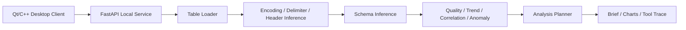

# LatticeIQ 中文文档

LatticeIQ 是一个由旧版 Qt/C++ 统计分析工具升级而来的本地 AI 表格分析工作台。项目目标不是再做一个普通“打开 Excel 画图”的小工具，而是把任意表格文件转化为可解释的数据画像、质量评估、分析规划和可交互桌面视图。

## 为什么这个项目更有展示价值

- **本地优先**：数据留在本机，桌面端和本地 Docker 服务配合运行。
- **跨栈工程**：Qt/C++ 负责桌面体验，Python/FastAPI 负责数据解析和分析。
- **动态表格解析**：不再写死 6 行 6 列，支持 Excel、CSV、TXT。
- **Analysis Planner**：根据字段角色、数据质量、趋势、相关性和异常，自动给出下一步分析路径。
- **可解释输出**：结果包含 evidence、schema、quality、tool trace，而不是只给一句结论。
- **可发布**：包含 Docker、CI、Windows 发布包脚本和工程化文档。

## 功能

- Excel / CSV / TXT 文件读取。
- TXT/CSV 自动识别编码、分隔符和表头。
- 字段类型识别：numeric、date、category、text、empty、high-cardinality。
- 数据质量评分：缺失值、重复行、异常值、样本量、字段可分析性。
- 分析建议：趋势分析、分组对比、相关性、异常复核、质量检查。
- 图表建议：根据 schema 推荐 line / bar / none。
- Executive Brief：自动生成摘要、置信度、风险提示和下一步动作。
- Analysis Planner：自动规划分析流程。
- 中英文界面切换。
- Windows zip 发布包脚本。

## 架构



## 快速运行

启动后端分析服务：

```powershell
docker compose up --build
```

健康检查：

```text
http://127.0.0.1:8000/health
```

Qt 项目入口：

```text
Statistical_Analysis/Statistical_Analysis.pro
```

推荐 Kit：

```text
Qt 6.11.1 MinGW 64-bit
```

示例 Excel：

```text
samples/latticeiq_demo_sales.xlsx
```

## Windows 发布包

```powershell
powershell -ExecutionPolicy Bypass -File packaging\build-windows-release.ps1
```

输出：

```text
dist/LatticeIQ.zip
```

发布包内的 `start-latticeiq.ps1` 会先启动 Docker Compose 分析服务，再打开桌面程序。

## 工程状态

- GitHub Actions：Python 测试、Docker build、API smoke、package metadata。
- Docker Compose：本地分析服务。
- MIT License。
- 原始旧版：`legacy-qt-statistical-analysis`。
- 现代化版本：`modern-ai-analysis-workbench`。
